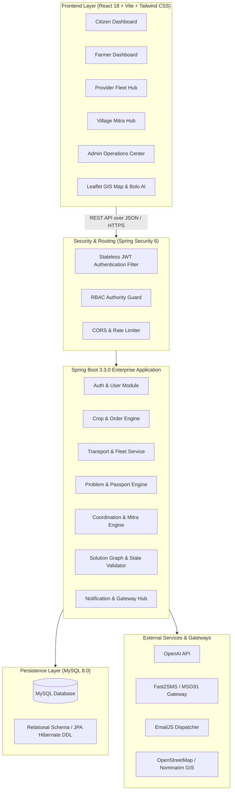

# 🌾 MANDI — Unified Rural Civic-Agri-Logistics & Community Coordination Ecosystem

<div align="center">


[](https://spring.io/projects/spring-boot)
[](https://www.oracle.com/java/)
[](https://reactjs.org/)
[](https://vitejs.dev/)
[](https://tailwindcss.com/)
[](https://www.mysql.com/)
[](https://leafletjs.com/)
[](https://www.docker.com/)
[](https://jwt.io/)
[](LICENSE)

**A Next-Generation Hyper-Local Platform Connecting Farmers, Citizens, Transport Providers, Ground Field Coordinators (Village Mitras), and District Administrative Authorities.**

[Key Features](#-core-features--capabilities) • [System Architecture](#-system-architecture) • [Role Portals](#-role-portals--personas) • [UI Screenshots & Previews](#-visual-interface-previews--screenshots) • [Tech Stack](#-complete-technology-stack) • [Quick Start](#-quick-start--installation) • [API Documentation](#-api-endpoints-reference) • [Test Suite](#-test-suite--regression-matrix)

---

</div>

## 📌 Executive Summary

**MANDI** is a full-stack hyper-local platform designed to bridge the digital and infrastructural divide in rural and semi-urban communities. It integrates four core operational personas (**Farmers**, **Citizens**, **Logistics Providers**, and **Village Mitras**) with an **Enterprise Command Operations Center** for administrators.

Whether it is solving critical civic issues (broken transformers, dry borewells, damaged roads) with GPS-geotagged **Problem Passports**, purchasing fresh farm produce through **Atomic Concurrency-Locked Crop Markets**, negotiating vehicle trips through **Linked Multi-Modal Transport Routing**, or escalating unattended rural needs through **Village Mitra Ground Verification**, MANDI provides a reliable and transparent workflow engine.

---

## 📸 Visual Interface Previews & Screenshots

### 1. Unified Landing & "Bolo" AI Voice Assistant
```
+-----------------------------------------------------------------------------------------------+
|  🌾 MANDI  | 🔍 Search crops, services, issues... | 🌐 Hindi / English | 👤 Rameshwar (Farmer) |
+-----------------------------------------------------------------------------------------------+
|                                                                                               |
|   🎙️ BOLO SMART ASSISTANT                                                                     |
|   "Bolkar apni samasya batayein ya fasal bechein"                                             |
|   [  🔴 Tap to Speak (AI Voice & Multilingual NLU Engine)  ]                                  |
|                                                                                               |
|   [🌾 Farm Marketplace]  [🚜 Book Transport]  [⚡ Report Civic Issue]  [📜 Govt Schemes]       |
+-----------------------------------------------------------------------------------------------+
|  📊 LIVE MANDI PULSE TICKER:                                                                 |
|  🌾 Wheat (Sharbati): ₹2,450/Qtl (▲ 2.4%) | 🥔 Potato: ₹1,120/Qtl | 🚜 Available Tractors: 14 |
+-----------------------------------------------------------------------------------------------+
```

### 2. Role Dashboards Overview

```
+-----------------------------------------------------------------------------------------------+
| 1. FARMER & PRODUCER HUB              | 2. CITIZEN & RESIDENTIAL PORTAL                       |
| - Live Harvest Crop Listings (Supply) | - One-Click Farm Produce Direct Purchasing            |
| - Concurrency-Safe Stock Manager      | - Geotagged Civic Issue Reporting (Photo + Audio)     |
| - Linked Mandi Transport Booker       | - Problem Passport Real-Time Tracking                 |
| - PM-Kisan & Subsidy Scheme Finder    | - Community TimeBank & Volunteer Seva                 |
+---------------------------------------+-------------------------------------------------------+
| 3. LOGISTICS & FLEET PROVIDER HUB     | 4. VILLAGE MITRA FIELD COMMAND                        |
| - Vehicle Fleet Registration (Tractor)| - Ground Case Verification with GPS Geotag            |
| - Date/Time Availability Slot Manager | - Zero-Match Offline Fallback Coordination            |
| - Two-Way Counter-Offer Bidding       | - Hierarchical Escalation (Village -> Block -> Dist)  |
| - Trip Milestone Execution Engine     | - Digital Kendra Assisted Citizen Service             |
+---------------------------------------+-------------------------------------------------------+
| 5. ADMIN & DISTRICT COMMAND OPERATIONS CENTER                                                 |
| - Multi-Department Workflows (PWD, UPPCL, Jal Nigam) | Live GIS Leaflet Heatmap Visualizer    |
| - Demand-Supply Deficit & Shortage Matrix            | Real-Time SLA Violation & Audit Logs   |
+-----------------------------------------------------------------------------------------------+
```

### 3. Problem Passport & Resolution Graph Workflow
```
+-----------------------------------------------------------------------------------------------+
| 🎫 TICKET: MANDI-2026-ELEC-0042  | STATUS: 🟡 IN_PROGRESS | SLA REMAINING: 13h 20m            |
+-----------------------------------------------------------------------------------------------+
| Title: Burnt 25kVA Agriculture Transformer                                                    |
| Location: Bakshi Ka Talab, Lucknow (26.9740° N, 80.9320° E)                                   |
| Assigned Org: UPPCL Rural Electricity Board (Er. R.K. Saxena)                                 |
+-----------------------------------------------------------------------------------------------+
| [✓] SUBMITTED  --->  [✓] ASSIGNED  --->  [⚙] WORK IN PROGRESS  --->  [ ] RESOLVED  ---> [ ] VERIFIED
| (Citizen App)         (UPPCL Admin)      (Field Team on Site)        (Proof Upload)     (Citizen OTP)
+-----------------------------------------------------------------------------------------------+
```

---

## 🌟 Core Features & Capabilities

### 🌾 1. Agricultural Marketplace & Atomic Stock Ledger
* **Farm-Gate Produce Listing**: Direct listing of crops (Wheat, Basmati Paddy, Mustard, Mangoes, etc.) with variety, moisture grade, harvest date, and expected pricing.
* **Atomic Inventory Protection**: Concurrency-safe transactions prevent overselling even under high-volume simultaneous checkout requests.
* **Direct Farmer-to-Consumer/Trader Trading**: Eliminates exploitative middlemen by enabling direct transparent bids and purchase orders.

### 🚜 2. Linked Multi-Modal Transport & Fleet Logistics
* **Seamless Trip Linking**: Converting accepted crop purchase orders or farm produce into an instant logistics transport request with a single click.
* **Vehicle Fleet Registry**: Support for diverse rural vehicles (Tractors, Hydraulic Trolleys, Pickups, Canters, 10-Ton Trucks).
* **Double-Booking Collision Guard**: Temporal validation engine blocks overlapping slot bookings for the same vehicle.
* **Interactive Counter-Offer Negotiation**: Providers can propose counter-pricing, alternative pickup dates, or custom time slots directly through the portal.

### 🏛️ 3. Geotagged Civic Reporting & Problem Passport Engine
* **Multimodal Intake**: Voice-assisted problem submission (Hindi/English), photo proof attachments, and GPS coordinate pinning.
* **Automated Department Routing**: Direct triage to civic bodies (e.g., UPPCL for electricity, Jal Nigam for drinking water, PWD for road repairs).
* **Immutable Audit Trail**: Step-by-step resolution logs, proof-of-work uploads, and citizen verification before tickets can be closed.

### 🤝 4. Village Mitra & Ground-Level Coordination Desk
* **Zero-Match Fallback**: If no automated vehicle or service provider is found in a region, requests automatically route to the nearest **Village Mitra**.
* **GPS Ground Verification**: Physical field inspections logged with precise coordinates and observation notes.
* **Hierarchical Escalation**: Unresolved village-level grievances escalate to Block Development Officers (BDO) and District Magistrates (DM).

### 🤖 5. "Bolo" AI Conversational Engine
* Natural speech recognition and AI assistant powered by OpenAI API for query resolution, crop advisory, scheme matching, and intuitive navigation.

### 🗺️ 6. Interactive GIS Map Explorer (Leaflet.js)
* Visual discovery of active crop sellers, available transport vehicles, verified NGO aid depots, and open civic issues with dynamic radius filtering.

### 🔔 7. Multi-Gateway Notification System
* In-app notifications with deduplication safeguards, SMS notifications via Fast2SMS / MSG91, and transactional email triggers via EmailJS.

---

## 🏗️ System Architecture



---

## 👥 Role Portals & Personas

| Persona / Role | Target User | Key Capabilities & Accessible Modules |
| :--- | :--- | :--- |
| **`ROLE_FARMER`** | Crop Producers, Smallholders | Crop listing, inventory management, tractor/logistics booking, market price monitoring, subsidy scheme discovery. |
| **`ROLE_CITIZEN`** | Village / Town Residents | Civic complaint logging (photo/voice), Problem Passport tracking, crop purchasing, volunteer seva, emergency transport. |
| **`ROLE_SERVICE_PROVIDER`** | Vehicle Owners, Drivers, Machinists | Fleet registration, slot calendar, trip counter-offers, job execution, earnings dashboard. |
| **`ROLE_MANDI_MITRA`** | Ground Volunteers, CSC Operators | Assisted civic reporting for non-digital citizens, ground verification, zero-match fallback, block escalation. |
| **`ROLE_ADMIN` / `SUPER_ADMIN`** | Department Heads, System Admins | Inter-department dispatch (UPPCL/PWD/Jal Nigam), SLA violation monitor, GIS heatmaps, user role authorization, audit logs. |

---

## 💻 Complete Technology Stack

### Frontend Architecture
* **Core Framework**: React 18.3.1 (SPA)
* **Build Tooling**: Vite 5.2.13
* **Styling**: Tailwind CSS 3.4.4, PostCSS 8.4.38, Autoprefixer 10.4.19
* **Routing**: React Router DOM 6.23.1
* **Geospatial & Mapping**: Leaflet 1.9.4, React-Leaflet 4.2.1
* **Iconography**: Lucide React 0.395.0
* **HTTP Client**: Axios 1.7.2 (with JWT Request & Response Interceptors)
* **Utilities**: clsx 2.1.1, tailwind-merge 2.3.0

### Backend Architecture
* **Runtime**: Java 21 LTS
* **Framework**: Spring Boot 3.3.0
* **Data Access**: Spring Data JPA, Hibernate ORM
* **Security**: Spring Security 6, Stateless JJWT (io.jsonwebtoken 0.12.5)
* **Validation**: Spring Boot Starter Validation (Hibernate Validator)
* **Database Driver**: MySQL Connector/J 8.3.0
* **Monitoring & Health**: Spring Boot Starter Actuator

### Database & Storage
* **Primary Database**: MySQL 8.0 (UTF-8mb4 unicode, InnoDB transaction engine)
* **Connection Pooling**: HikariCP (optimized for concurrent transaction locks)

### External Services & Gateways
* **AI & NLU**: OpenAI GPT Models
* **Telecom SMS**: Fast2SMS & MSG91 REST APIs
* **Transactional Email**: EmailJS Client Gateway
* **Mapping Tiles**: OpenStreetMap CartoDB Tiles

---

## 🗄️ Database Entity Schema Overview

```
 +------------------+          +-------------------+          +-------------------+
 |      USERS       | 1      * |   CROP_LISTINGS   | 1      * |    CROP_ORDERS    |
 |------------------| -------- |-------------------| -------- |-------------------|
 | id (PK)          |          | id (PK)           |          | id (PK)           |
 | phone (UNIQUE)   |          | farmer_id (FK)    |          | crop_id (FK)      |
 | email            |          | crop_name         |          | buyer_id (FK)     |
 | password         |          | quantity_quintals |          | quantity_quintals |
 | full_name        |          | price_per_quintal |          | order_status      |
 +------------------+          +-------------------+          +-------------------+
          | 1                                                           | 1
          |                                                             |
          | *                                                           | 1
 +------------------+          +-------------------+          +-------------------+
 |     PROBLEMS     | 1      1 | PROBLEM_PASSPORTS |          | TRANSPORT_REQUESTS|
 |------------------| -------- |-------------------|          |-------------------|
 | id (PK)          |          | id (PK)           |          | id (PK)           |
 | user_id (FK)     |          | problem_id (FK)   |          | linked_order (FK) |
 | title            |          | passport_code     |          | requester_id (FK) |
 | category         |          | qr_verification   |          | assigned_vehicle  |
 | urgency          |          | milestone_history |          | trip_status       |
 | status           |          +-------------------+          +-------------------+
 +------------------+
```

---

## 🚀 Quick Start & Installation

### Prerequisites
* **Java**: JDK 21+ installed and configured in `PATH`
* **Node.js**: Node.js v18+ or v20+ with `npm`
* **MySQL**: MySQL 8.0 Server running on port `3306` (or use Docker)
* **Git**: Git CLI

---

### Option 1: One-Click Launch via Docker Compose (Recommended)

Run the entire platform (MySQL, Spring Boot Backend, and React Frontend) with a single command:

```bash
# Clone the repository
git clone https://github.com/AmitKumar9430/Mandi-.git
cd Mandi-

# Start all containers in background
docker compose up --build -d

# Verify container health
docker compose ps
```

* **Frontend**: `http://localhost:3000`
* **Backend API**: `http://localhost:8080`
* **MySQL Database**: `localhost:3306`

---

### Option 2: Manual Local Setup (Step-by-Step)

#### 1. Setup MySQL Database
Open your MySQL client and create the database:
```sql
CREATE DATABASE mandidb CHARACTER SET utf8mb4 COLLATE utf8mb4_unicode_ci;
```

#### 2. Backend Setup
Navigate to the `backend/` directory:
```bash
cd backend

# Configure application properties or pass environment variables
# (Default points to localhost:3306/mandidb with user: root / password: )

# Build and run the Spring Boot application
mvn clean spring-boot:run
```
The backend will launch on `http://localhost:8080` and automatically seed all default roles, users, departments, schemes, and sample complaints!

#### 3. Frontend Setup
Open a new terminal window and navigate to `frontend/`:
```bash
cd frontend

# Install node dependencies
npm install

# Start the Vite local development server
npm run dev
```
The frontend will start instantly at `http://localhost:5173`.

---

## 🔐 Default Demo Accounts & Seed Credentials

The database automatically initializes with ready-to-test accounts across all roles:

| Role / Persona | Username / Identifier | Password | Designated Function |
| :--- | :--- | :--- | :--- |
| 👑 **Super Admin** | `amitkr9523da@gmail.com` | `Admin@123` | Master platform administrator |
| 👨‍🌾 **Farmer / Producer** | `9876543211` *(or `farmer@mandi.org`)* | `Password@123` | Balram Singh (Crop seller & mandi logistics) |
| 🧑‍💼 **Citizen / Resident** | `9876543210` *(or `citizen@mandi.org`)* | `Password@123` | Rameshwar Kumar (Buyer & civic complainant) |
| 🚜 **Transport Provider** | `9876543215` *(or `provider@mandi.org`)* | `Password@123` | Awadh Kisan Agri Services (Fleet operator) |
| 🤝 **Village Mitra** | `9876543216` *(or `mitra@mandi.org`)* | `Password@123` | Suresh MANDI Mitra (Ground coordinator) |
| 🛠️ **Technician / Worker** | `9876543212` *(or `worker@mandi.org`)* | `Password@123` | Chhotu Lal Mistri (Borewell repair specialist) |
| 🏢 **Accredited NGO** | `9876543214` *(or `ngo@mandi.org`)* | `Password@123` | Gramin Vikas Sansthan (Grain storage & aid) |
| 🏛️ **System Admin** | `9876543217` *(or `admin@mandi.org`)* | `Password@123` | MANDI System Admin |

---

## ⚙️ Environment Variables Configuration

### Backend (`backend/src/main/resources/application.yml` or OS Environment)
| Variable | Description | Default / Example Value |
| :--- | :--- | :--- |
| `PORT` | Backend server port | `8080` |
| `SPRING_DATASOURCE_URL` | MySQL JDBC connection string | `jdbc:mysql://localhost:3306/mandidb` |
| `SPRING_DATASOURCE_USERNAME` | Database user | `root` / `mandi_user` |
| `SPRING_DATASOURCE_PASSWORD` | Database password | `rootpassword` / `mandi_password` |
| `JWT_SECRET` | Secret key for HS512 JWT signing | `(Auto-generated 512-bit safe key)` |
| `MANDI_CORS_ALLOWED_ORIGINS` | Allowed CORS origins (comma-separated)| `http://localhost:5173,http://localhost:3000` |
| `OPENAI_API_KEY` | OpenAI API key for Bolo Assistant | `sk-...` |
| `FAST2SMS_API_KEY` | Fast2SMS Gateway Key | *(Optional)* |
| `MSG91_AUTH_KEY` | MSG91 SMS Gateway Key | *(Optional)* |
| `EMAILJS_SERVICE_ID` | EmailJS Service ID | *(Optional)* |
| `EMAILJS_PUBLIC_KEY` | EmailJS Public Key | *(Optional)* |

### Frontend (`frontend/.env` or `.env.production`)
| Variable | Description | Default Value |
| :--- | :--- | :--- |
| `VITE_API_URL` | Base endpoint URL for Backend REST API | `http://localhost:8080/api` |

---

## 📖 API Endpoints Reference

### 1. Authentication & Users (`/api/auth`, `/api/users`)
* `POST /api/auth/register` — Register a new user with specific role(s) and location.
* `POST /api/auth/login` — Stateless authentication returning signed JWT token and user profile.
* `GET /api/users/profile` — Fetch current logged-in user profile with trust score and statistics.
* `PUT /api/users/profile` — Update address, district, state, preferred language, and avatar.

### 2. Crops & Farm Marketplace (`/api/crops`, `/api/crop-orders`)
* `GET /api/crops` — Discover active crop listings with category and district filtering.
* `POST /api/crops` — Create a new crop produce listing *(Requires `ROLE_FARMER`)*.
* `POST /api/crop-orders` — Place atomic concurrency-locked purchase order *(Requires `ROLE_CITIZEN`)*.
* `POST /api/crop-orders/{id}/accept` — Farmer accepts purchase offer.
* `POST /api/crop-orders/{id}/complete` — Buyer confirms delivery and releases milestone.
* `POST /api/crop-orders/{id}/rate` — Submit 5-star mutual rating and verified review.

### 3. Transport & Fleet Logistics (`/api/transport`)
* `POST /api/transport/vehicles` — Register fleet vehicle with capacity and radius *(Requires `ROLE_SERVICE_PROVIDER`)*.
* `POST /api/transport/vehicles/{id}/availability` — Publish date and time availability slots.
* `POST /api/transport/requests` — Submit a raw freight or produce haulage request.
* `POST /api/coordination/crop-order-transport` — Auto-generate linked transport request from crop order.
* `POST /api/transport/requests/{id}/accept?vehicleId={id}` — Accept trip with double-booking collision guard.
* `POST /api/coordination/counter-offer` — Submit counter-bid (custom price / alternative time).
* `POST /api/transport/requests/{id}/confirm-counter` — Customer accepts counter-offer.
* `POST /api/transport/requests/{id}/complete` — Driver marks trip complete.

### 4. Civic Problems & Resolution Passports (`/api/problems`, `/api/solution-graph`)
* `GET /api/problems` — List public issues with status, urgency, and category filters.
* `POST /api/problems` — Submit geotagged complaint with optional audio & photo proof.
* `GET /api/problems/{id}` — Full problem passport with timeline events and assigned organization.
* `POST /api/solution-graph/{problemId}/steps/{stepId}/assign` — Assign step to worker or field engineer.
* `POST /api/solution-graph/{problemId}/steps/{stepId}/complete` — Complete step with proof attachment.

### 5. Village Mitra Coordination Desk (`/api/village-mitra`, `/api/coordination`)
* `POST /api/coordination/mitra-fallback` — Route zero-match request to nearest Village Mitra.
* `POST /api/village-mitra/verify` — Submit geotagged ground inspection report with GPS coordinates.
* `POST /api/village-mitra/escalate/{id}` — Hierarchical escalation to Block/District authorities.
* `GET /api/village-mitra/my-cases` — List active cases assigned to the authenticated Village Mitra.
* `GET /api/coordination/demand-supply-gap` — Live regional shortage & deficit analysis matrix *(Admin)*.
* `GET /api/coordination/opportunities` — Tailored smart opportunity feed matching current user role.

### 6. In-App Notifications (`/api/notifications`)
* `GET /api/notifications` — Fetch user notification feed with deduplication.
* `GET /api/notifications/unread-count` — Count of unread alerts.
* `POST /api/notifications/read-all` — Mark all notifications as read.

---

## 🧪 Test Suite & Regression Matrix

The repository includes a 27-point end-to-end integration and concurrency test suite in `test_unified_platform.py` that validates all 4 roles and security guarantees:

```bash
# Execute the full automated regression suite
python test_unified_platform.py
```

### Verified Test Matrix:
```
================================================================================
🚀 MANDI COMPLETE 4-ROLE COORDINATION & DEMAND-SUPPLY ENGINE TEST SUITE
================================================================================
[PASS] TEST 01: 4-Role JWT Authentication (Admin, Farmer, Provider, Citizen, Mitra)
[PASS] TEST 02: Farmer Lists Crop Produce (Supply Creation)
[PASS] TEST 03: Citizen Places Crop Purchase Order (Demand Generation)
[PASS] TEST 04: Atomic Inventory Lock (Excess Stock Purchase Blocked)
[PASS] TEST 05: Farmer Accepts Crop Purchase Order
[PASS] TEST 06: Linked Transport Request Generated from Crop Order
[PASS] TEST 07: Provider Registers Vehicle (Capacity & Service Radius Set)
[PASS] TEST 08: Provider Publishes Availability Slot
[PASS] TEST 09: Provider Accepts Linked Transport Job (Booking Created)
[PASS] TEST 10: Double-Booking Collision Guard (Overlapping Slot Blocked)
[PASS] TEST 11: Provider Submits Counter-Offer (Price/Date/Time)
[PASS] TEST 12: Requester Confirms Counter-Offer (Agreement Locked)
[PASS] TEST 13: Provider Completes Trip (Milestone & Fleet Stats Updated)
[PASS] TEST 14: Zero-Match Fallback -> Nearest Village Mitra Assigned
[PASS] TEST 15: Village Mitra Geotagged Ground Verification
[PASS] TEST 16: Village Mitra Hierarchical Escalation (Block Level)
[PASS] TEST 17: Live Demand-Supply Shortage & Deficit Matrix
[PASS] TEST 18: Role-Personalized Smart Opportunity Feeds (All 4 Roles)
[PASS] TEST 19: In-App Notification Dispatch & Deduplication Guard
[PASS] TEST 20: Notification Read Status Tracking
[PASS] TEST 21: Security RBAC Enforcement (Citizen Blocked from Provider Action)
[PASS] TEST 22: Role Forgery Prevention (Backend Authenticated Principal Enforced)
[PASS] TEST 23: Citizen Confirms Crop Delivery (Order Completed)
[PASS] TEST 24: 5-Star Rating & Community Review Recorded
[PASS] TEST 25: Village Mitra Assigned Case Log & Coordination Directory
[PASS] TEST 26: Farmer Direct Mandi Transport Request
[PASS] TEST 27: End-to-End Platform Regression & System Health
================================================================================
🎉 ALL 27/27 TEST SCENARIOS EXECUTED SUCCESSFULLY
================================================================================
```

---

## 📂 Project Directory Structure

```
MANDI/
├── backend/                             # Spring Boot 3.3.0 Application
│   ├── Dockerfile                       # Multi-stage JDK 21 Alpine container
│   ├── pom.xml                          # Maven dependencies & build configurations
│   └── src/
│       ├── main/java/com/mandi/
│       │   ├── MandiApplication.java   # Spring Boot entry point
│       │   ├── admin/                   # Admin moderation, analytics, audit controllers
│       │   ├── agriculture/             # Crop listings, crop orders, pricing services
│       │   ├── auth/                    # JWT authentication filters & security tokens
│       │   ├── booking/                 # Resource bookings and slot reservations
│       │   ├── chat/                    # In-app contextual messaging engine
│       │   ├── common/                  # Shared response formats, enums, exceptions
│       │   ├── community/               # TimeBank, Volunteer Seva, civic feeds
│       │   ├── config/                  # WebMvc, DataSeeder, Security configuration
│       │   ├── coordination/            # Fallback engine, counter-offers, shortage matrix
│       │   ├── email/                   # EmailJS integration service
│       │   ├── job/                     # Rural livelihood & job posting models
│       │   ├── matching/                # Smart geo-spatial provider matching engine
│       │   ├── mitra/                   # Village Mitra ground inspection & escalation
│       │   ├── notification/            # In-app alert dispatch & deduplication
│       │   ├── organization/            # Public departments (UPPCL, PWD, Jal Nigam)
│       │   ├── problem/                 # Civic problems, passports, timeline events
│       │   ├── pulse/                   # Real-time community stats & ticker updates
│       │   ├── resource/                # Shared village equipment & NGO inventory
│       │   ├── scheme/                  # Government welfare & subsidy schemes
│       │   ├── security/                # UserPrincipal, JWT Token Provider, Auth handlers
│       │   ├── solution/                # Multi-step solution graph engine
│       │   ├── transport/               # Fleet vehicles, availability, trip logistics
│       │   └── user/                    # User entities, roles, profiles, trust scores
│       └── main/resources/
│           └── application.yml          # Spring configuration & datasource profiles
│
├── frontend/                            # React 18 + Vite + Tailwind CSS Application
│   ├── Dockerfile                       # Production Nginx container build
│   ├── nginx.conf                       # Production reverse proxy & SPA router fallback
│   ├── package.json                     # NPM dependencies & scripts
│   ├── tailwind.config.js               # Theme configuration
│   ├── vite.config.js                   # Vite bundler configuration
│   ├── public/
│   │   ├── _redirects                   # Netlify SPA routing rules
│   │   └── rural_village_landscape.jpg  # Platform branding graphic
│   └── src/
│       ├── App.jsx                      # Route definitions & portal namespaces
│       ├── api/                         # Axios client with JWT interceptors
│       ├── auth/                        # UserAuthContext & AdminAuthContext
│       ├── components/                  # Reusable UI widgets (BoloHero, Map, Lightbox)
│       │   ├── agriculture/             # Crop Marketplace & Purchase modals
│       │   ├── chat/                    # Contextual chat drawers
│       │   ├── matching/                # Provider calendar & match modals
│       │   ├── mitra/                   # Mitra verification cards
│       │   └── transport/               # Fleet management & vehicle modals
│       ├── context/                     # Language (HI/EN) and global state context
│       ├── portals/
│       │   ├── admin/                   # Admin Operations Center pages & layout
│       │   └── user/                    # 4-Role User Portals & dedicated dashboards
│       └── shared/                      # Shared API clients & location services
│
├── docker-compose.yml                   # Unified multi-container orchestration
├── netlify.toml                         # Netlify deployment configuration
├── render.yaml                          # Render cloud deployment blueprint
├── test_unified_platform.py             # 27-Scenario Automated Python Test Suite
├── test_workflow.ps1                    # PowerShell test runner
└── README.md                            # Complete Project Documentation
```

---

## 🌐 Production Deployment

### Netlify (Frontend)
The frontend includes a pre-configured `netlify.toml` and `_redirects` file.
1. Connect your repository to Netlify.
2. Set Build Command: `npm run build`
3. Set Publish Directory: `dist`
4. Set Environment Variable: `VITE_API_URL` -> `https://your-backend-api.onrender.com/api`

### Render / AWS / GCP (Backend & MySQL)
1. Deploy a managed MySQL 8.0 instance.
2. Deploy the backend as a Web Service using the provided `backend/Dockerfile` or native Java environment.
3. Configure Environment Variables (`SPRING_DATASOURCE_URL`, `SPRING_DATASOURCE_USERNAME`, `SPRING_DATASOURCE_PASSWORD`, `MANDI_CORS_ALLOWED_ORIGINS`).

---

## 📄 License & Credits

This project is open-source and available under the **MIT License**.

Designed and developed with ❤️ for empowering rural and semi-urban communities through transparent technology, collective coordination, and sustainable local economies.
